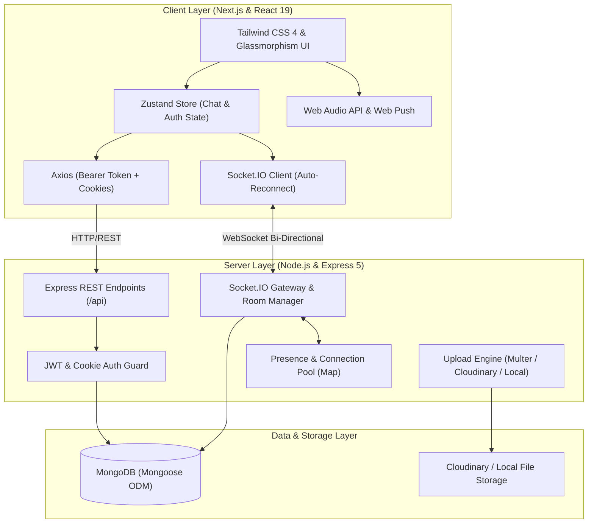
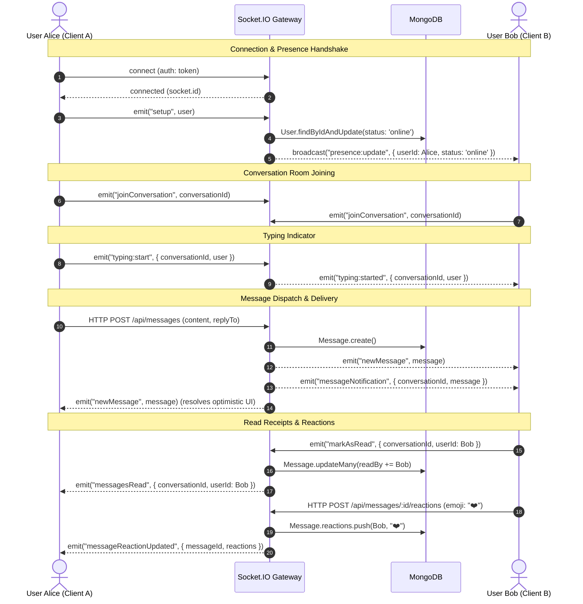

# PulseChat — System Design & Tech Stack Architecture

A comprehensive technical blueprint of the real-time chat and group channels platform built with **Next.js**, **React**, **Tailwind CSS**, **Node.js**, **Express**, **MongoDB**, and **Socket.IO**.

---

## 1. System Architecture Overview

The system is structured as a decoupled client-server architecture with dual transport layers: **RESTful HTTP** for resource management, state queries, and authentication, alongside a persistent bi-directional **WebSocket / Socket.IO** transport for instantaneous event dispatching.



---

## 2. Tech Stack Breakdown & Rationale

| Component | Technology | Rationale & Responsibility |
| :--- | :--- | :--- |
| **Frontend Framework** | **Next.js 16 (App Router) + React 19** | Server-side routing, fast Turbopack compilation, dynamic route segments (`/chat/[conversationId]`), and seamless SPA client interactivity. |
| **Styling & Design** | **Tailwind CSS 4** | Utility-first CSS, dark glassmorphism, responsive breakpoints, sleek transitions, and custom low-overhead scrollbars. |
| **State Management** | **Zustand 5** | Lightweight, reactive, and boilerplate-free state stores (`useChatStore`, `useAuthStore`) enabling optimistic updates with immediate re-renders. |
| **Backend Runtime** | **Node.js + Express 5** | Non-blocking event loop ideal for asynchronous I/O, file streaming, and API routing. |
| **Real-Time Engine** | **Socket.IO 4** | WebSocket connection with fallback to HTTP long-polling, heartbeat ping/pong, room-based multicasting (`conversation:<id>`, `user:<id>`), and auto-reconnection. |
| **Database & ODM** | **MongoDB + Mongoose 9** | Document-oriented data model fitting nested chat attachments, reactions, threaded replies, and full-text index queries. |
| **Authentication** | **JWT + Bcrypt** | Stateless authentication tokens stored in secure HTTP-only cookies and backed with `Authorization: Bearer` fallback. |
| **Media Pipeline** | **Multer + Cloudinary** | Memory-buffered multipart uploads with direct Cloudinary cloud storage and fallback to local disk storage. |

---

## 3. Database Schema & Data Models

### A. User Schema (`User.js`)
```javascript
{
  name: { type: String, required: true, trim: true },
  username: { type: String, required: true, unique: true, lowercase: true, index: true },
  email: { type: String, required: true, unique: true, lowercase: true },
  password: { type: String, required: true, select: false },
  avatar: { type: String, default: "" },
  status: { type: String, enum: ["online", "offline"], default: "offline" },
  lastSeen: { type: Date, default: null }
}
```

### B. Conversation Schema (`Conversation.js`)
```javascript
{
  type: { type: String, enum: ["direct", "group"], default: "direct" },
  name: { type: String, trim: true, default: "" },
  avatar: { type: String, default: "" },
  members: [{ type: ObjectId, ref: "User", index: true }],
  admins: [{ type: ObjectId, ref: "User" }],
  createdBy: { type: ObjectId, ref: "User", required: true },
  lastMessage: { type: ObjectId, ref: "Message", default: null }
}
```

### C. Message Schema (`Message.js`)
```javascript
{
  conversation: { type: ObjectId, ref: "Conversation", required: true, index: true },
  sender: { type: ObjectId, ref: "User", required: true },
  content: { type: String, trim: true, default: "" },
  type: { type: String, enum: ["text", "image", "video", "document", "audio"], default: "text" },
  attachments: [{
    url: String,
    publicId: String,
    fileName: String,
    mimeType: String,
    size: Number,
    type: String
  }],
  reactions: [{
    user: { type: ObjectId, ref: "User" },
    emoji: String
  }],
  replyTo: { type: ObjectId, ref: "Message", default: null },
  deliveredTo: [{ type: ObjectId, ref: "User" }],
  readBy: [{ type: ObjectId, ref: "User" }]
}
// Indexes:
messageSchema.index({ content: "text" });
messageSchema.index({ conversation: 1, createdAt: -1 });
```

---

## 4. Real-Time Protocol & Socket.IO Lifecycle



---

## 5. Resilience & Fault Tolerance Strategies

1. **Auto-Reconnection**:
   - Client Socket.IO instance configured with `reconnectionAttempts: Infinity`, `reconnectionDelay: 1000ms`, `reconnectionDelayMax: 5000ms`.
   - On reconnect, the client automatically re-authenticates via `setup`, queries online users, and rejoins the active conversation room.
2. **Optimistic UI Updates**:
   - User inputs appear instantaneously in the chat timeline with a temporary ID (`temp-${timestamp}`) and a pending clock indicator.
   - On server acknowledgement, the temporary message is swapped in-place without jarring layout reflows.
   - If an error occurs, the failed optimistic node is rolled back and an alert is shown.
3. **Cursor-Based Infinite Scrolling**:
   - Queries fetch chronological slices using `before: oldestMessage.createdAt` and `limit: 30`.
   - Scroll offsets are preserved using `previousScrollHeight` calculations in `useLayoutEffect`, preventing the viewport from jumping to the top when older messages load.

---

## 6. Security & Authorization

- **Layered Authentication**: Accepts HTTP-Only Cookies (preventing XSS token exfiltration) and `Authorization: Bearer <token>` headers for cross-origin or proxy calls.
- **Strict Channel Authorization**: Access control checks ensure only members of a conversation can fetch its messages or dispatch messages into its room.
- **Admin Role Hierarchy**:
  - Only designated Group Admins can add/remove participants, promote members, or change channel settings.
  - Channels ensure at least one active administrator remains.
